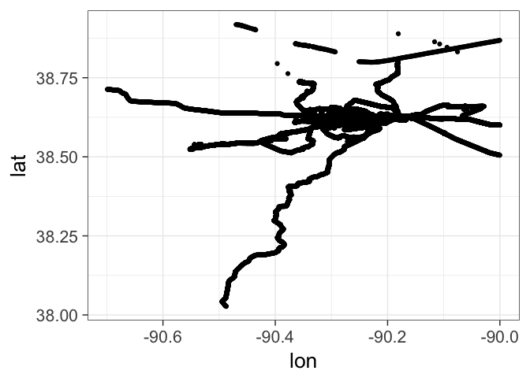
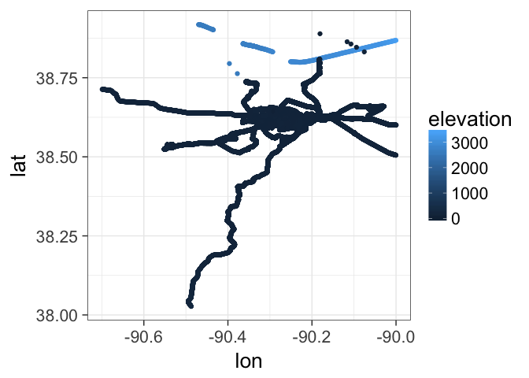
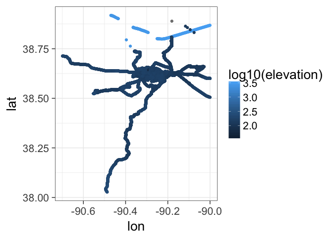
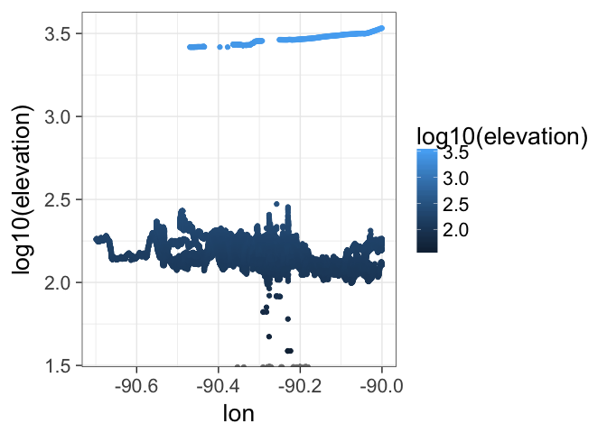
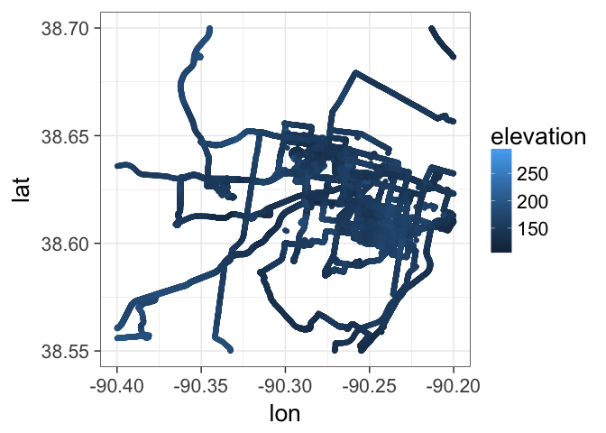
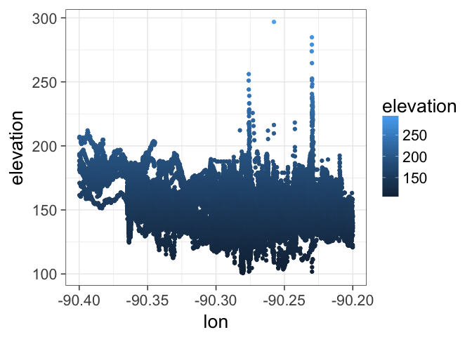
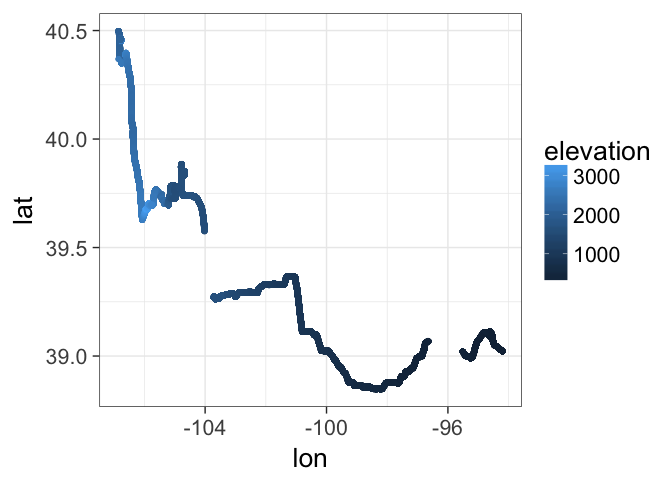
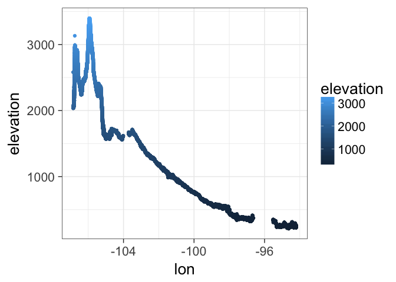

# cats
JL  
9/21/2017  


```r
library(dplyr)
```

```
## 
## Attaching package: 'dplyr'
```

```
## The following objects are masked from 'package:stats':
## 
##     filter, lag
```

```
## The following objects are masked from 'package:base':
## 
##     intersect, setdiff, setequal, union
```

```r
library(ggplot2)
theme_set(theme_bw(20))
library(scatterplot3d)
load("loc.RData")

loc_gc <- filter(loc, lat < 38.9270 & lat > 38.0270) %>% filter(lon > -90.6994& lon < -90.0)

ggplot(loc_gc, aes(x = lon, y = lat)) + geom_point()
```

<!-- -->

```r
ggplot(loc_gc, aes(x = lon, y = lat,colour=elevation)) + geom_point()
```

<!-- -->

```r
ggplot(loc_gc, aes(x = lon, y = lat,colour=log10(elevation))) + geom_point()
```

<!-- -->

```r
ggplot(loc_gc, aes(x = lon, y = log10(elevation),colour=log10(elevation))) + geom_point()
```

<!-- -->

```r
# ggplot(loc_gc, aes(x = lon, y = lat,colour=elevation)) + geom_point()
loc_gc <- filter(loc, lat < 38.7 & lat > 38.55) %>% filter(lon > -90.4& lon < -90.2)

# ggplot(loc_gc, aes(x = lon, y = lat,colour=elevation)) + geom_point()
loc_gc <- filter(loc_gc, elevation < 2000&elevation >100)

ggplot(loc_gc, aes(x = lon, y = lat,colour=elevation)) + geom_point()
```

<!-- -->

```r
ggplot(loc_gc, aes(x = lon, y = elevation,colour=elevation)) + geom_point()
```

<!-- -->

```r
loc_gc <- filter(loc,  lon < -94.2&elevation >0)
ggplot(loc_gc, aes(x = lon, y = lat,colour=elevation)) + geom_point()
```

<!-- -->

```r
ggplot(loc_gc, aes(x = lon, y = elevation,colour=elevation)) + geom_point()
```

<!-- -->

```r
file.copy("./cats.md","./README.md",overwrite = TRUE)
```

```
## [1] TRUE
```

