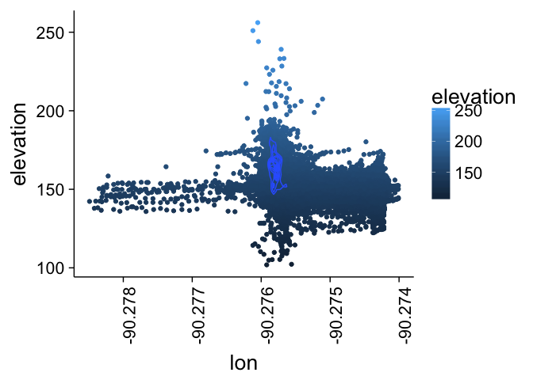

# cats
JL  
9/23/2017  


```r
library(dplyr)
```

```
## 
## Attaching package: 'dplyr'
```

```
## The following objects are masked from 'package:stats':
## 
##     filter, lag
```

```
## The following objects are masked from 'package:base':
## 
##     intersect, setdiff, setequal, union
```

```r
library(ggplot2)
theme_set(theme_bw(20))
t2 <- theme(
    axis.line = element_line(colour = "black"),
    axis.text = element_text(colour = "black"),
    axis.ticks = element_line(colour = "black"),
    panel.grid.major.x = element_blank(),
    panel.grid.minor.x = element_blank(),
    panel.grid.major.y = element_blank(),
    panel.grid.minor.y = element_blank(),
    panel.border = element_blank(),
    panel.background = element_blank(),
    axis.text.x=element_text(angle=90,hjust=1)
)
library(scatterplot3d)
library(MASS)
```

```
## 
## Attaching package: 'MASS'
```

```
## The following object is masked from 'package:dplyr':
## 
##     select
```

```r
load("loc.RData")

0.0025
```

```
## [1] 0.0025
```

```r
loc_gc <- filter(loc, lat < 38.6490 & lat > 38.6465) %>% filter(elevation>100&lon > -90.2775& lon < -90.275)

z <- kde2d(loc_gc$lat, loc_gc$lon)

ggplot(loc_gc, aes(x = lon, y = lat,colour=elevation)) + geom_point()+ geom_density_2d()+t2
```

<!-- -->

```r
ggplot(loc_gc, aes(x = lon, y = elevation,colour=elevation)) + geom_point()+ geom_density_2d()+t2
```

<!-- -->

```r
ggplot(loc_gc, aes(x = lat, y = elevation,colour=elevation)) + geom_point()+ geom_density_2d()+t2
```

<!-- -->

```r
 ggplot(loc_gc, aes(x = lon, y = lat))+stat_density2d(aes(fill=..density..), geom="raster", contour=FALSE) +
  scale_fill_gradient2(low="blue", mid="white", high="black") +t2
```

<!-- -->

