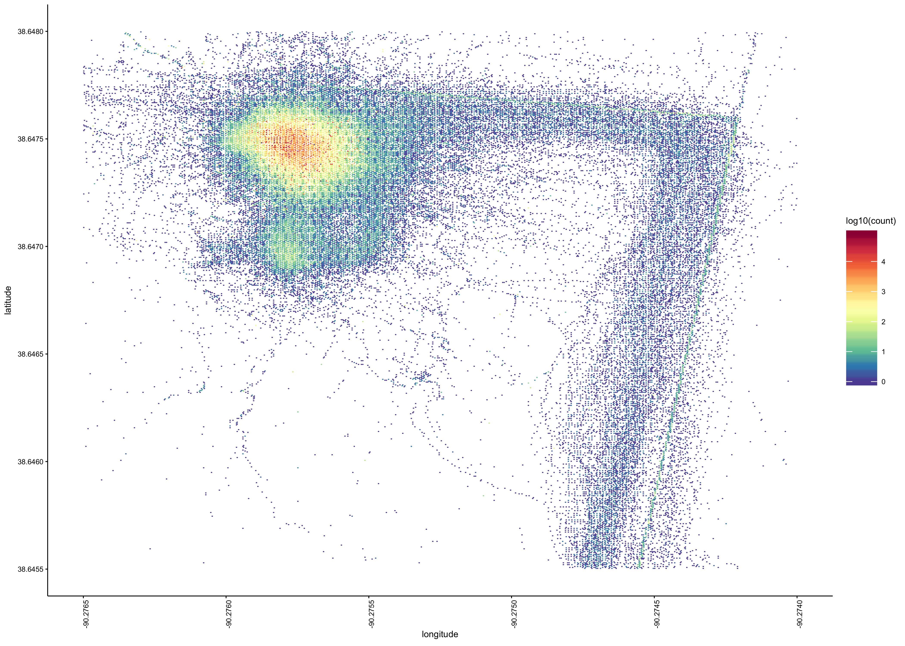<!-- -->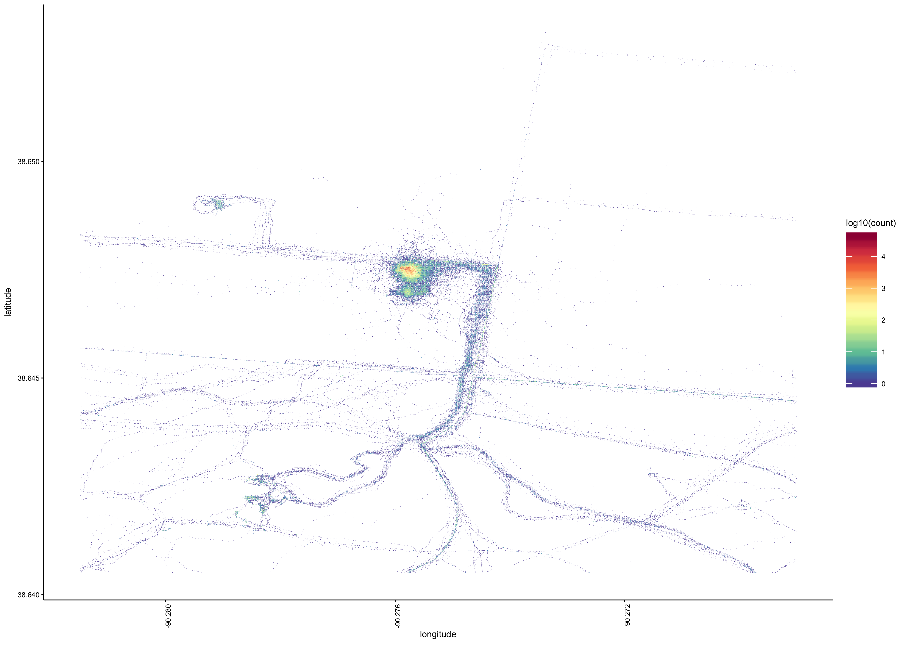<!-- -->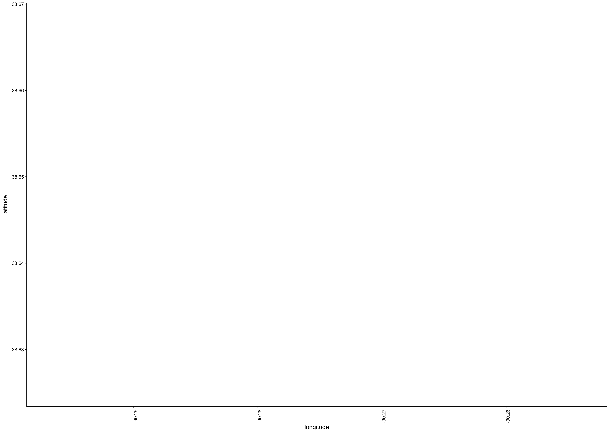<!-- -->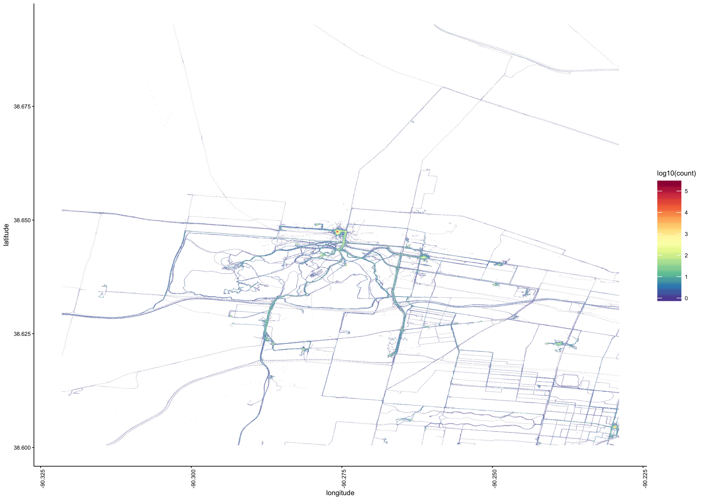<!-- -->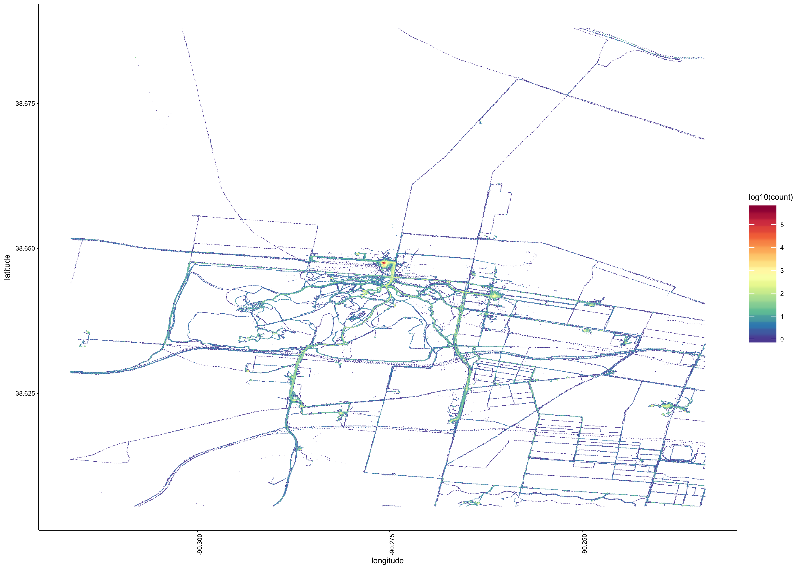<!-- -->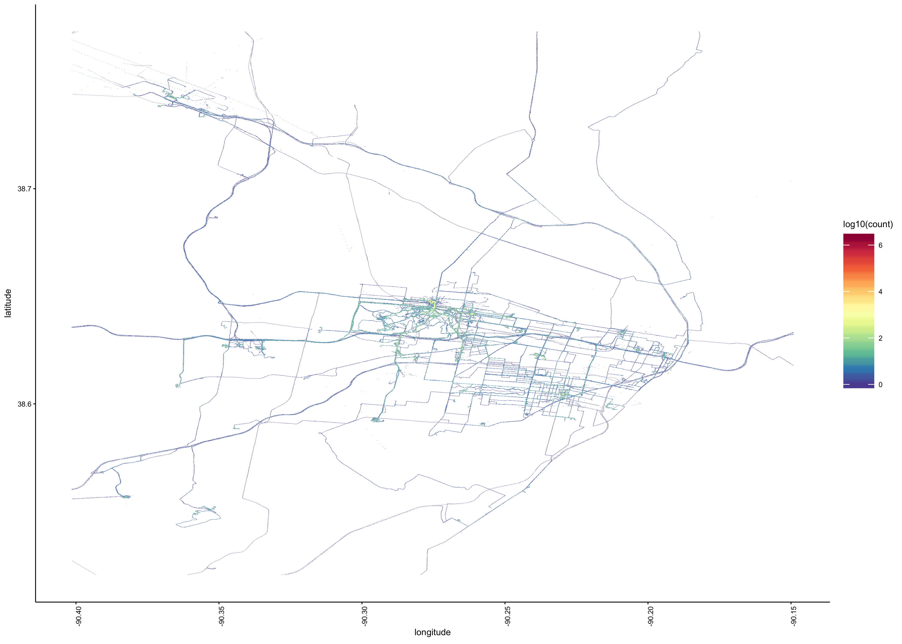<!-- -->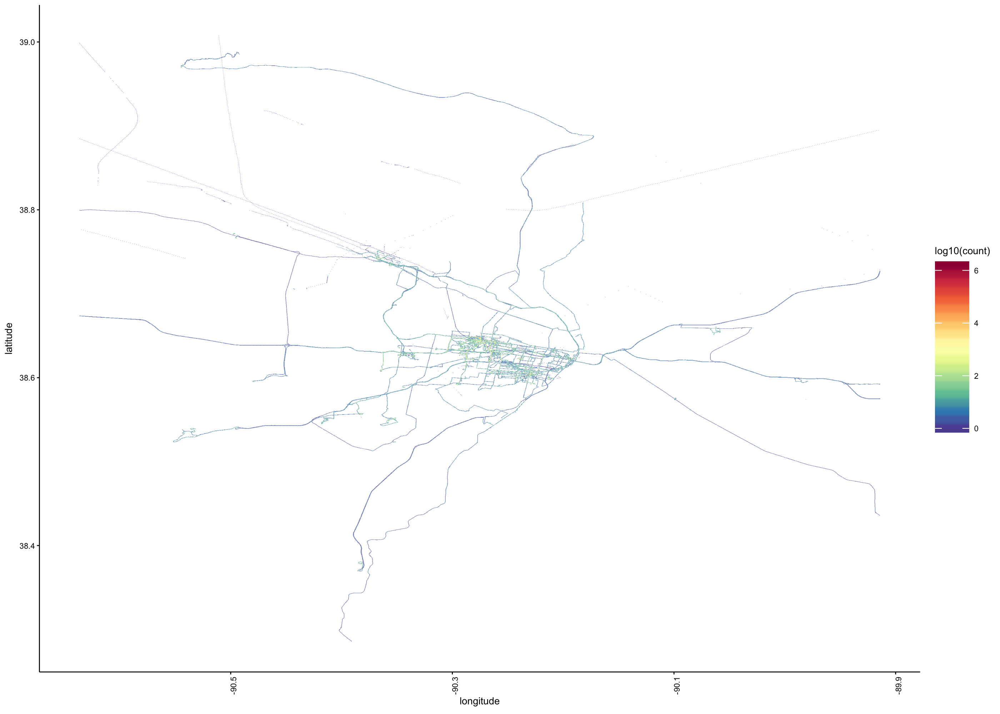<!-- -->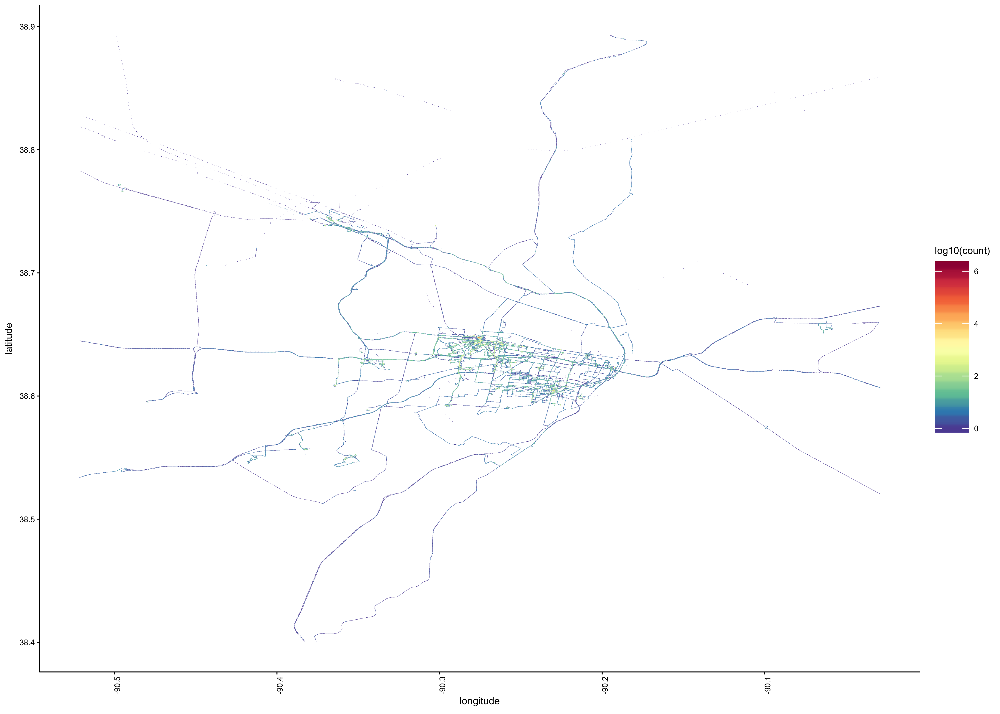<!-- -->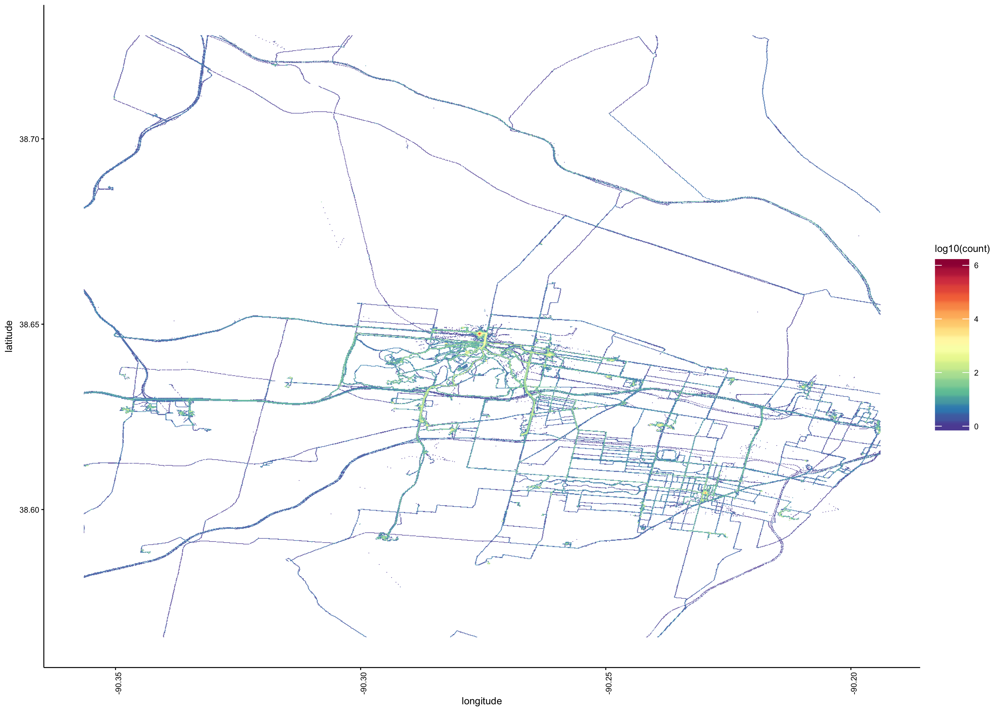<!-- -->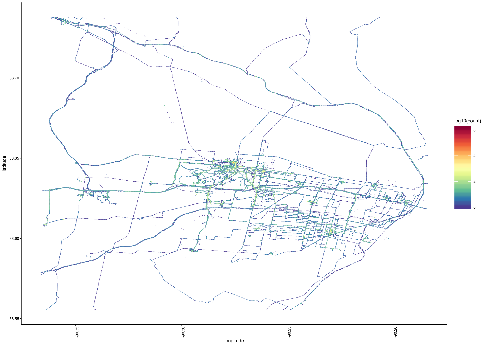<!-- --><!-- -->

### Pressure
- lat max = 39.148
- lat min = 38.1455
- lon max = -89.774
- lon min = -90.7765

<!-- -->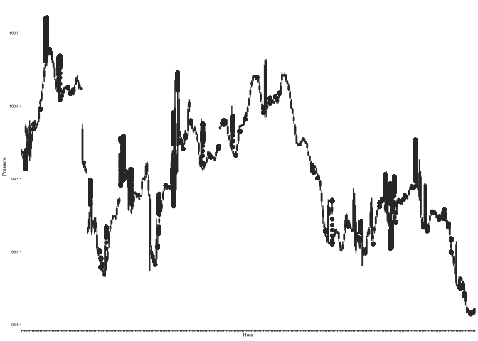<!-- -->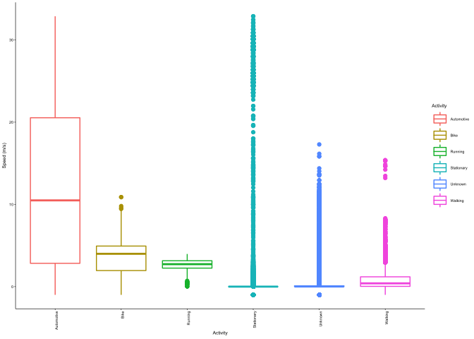<!-- -->

Var1            Freq
-----------  -------
Automotive     14046
Bike            6734
Running          909
Stationary    841417
Unknown       103876
Walking        29637

