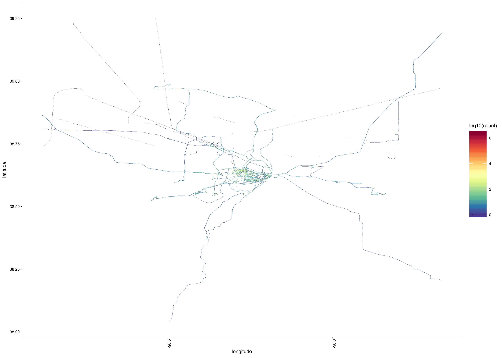
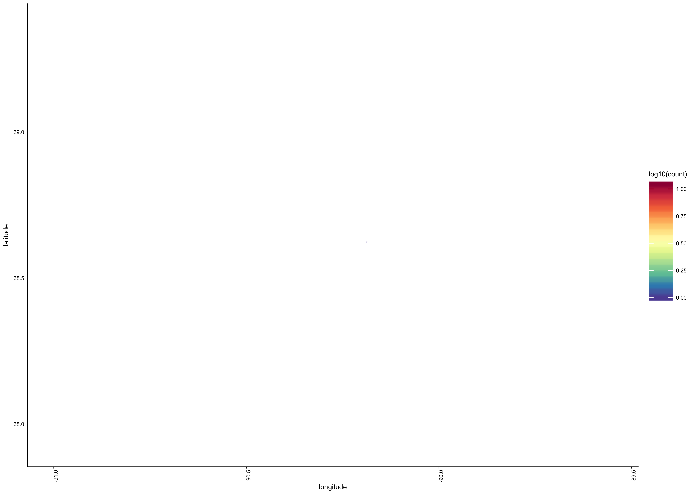
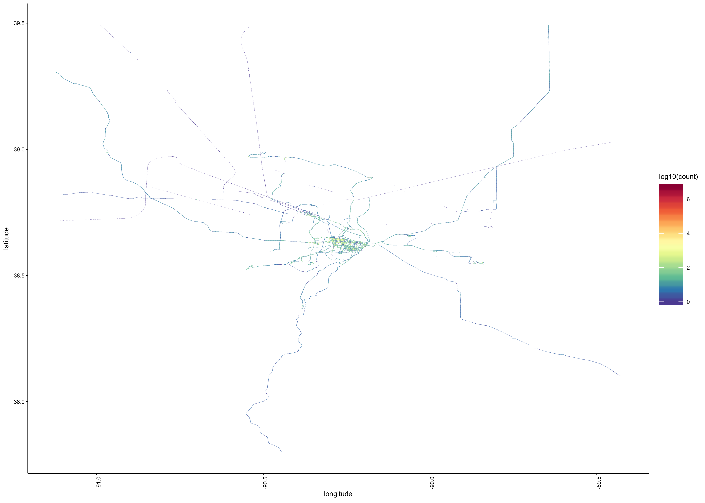
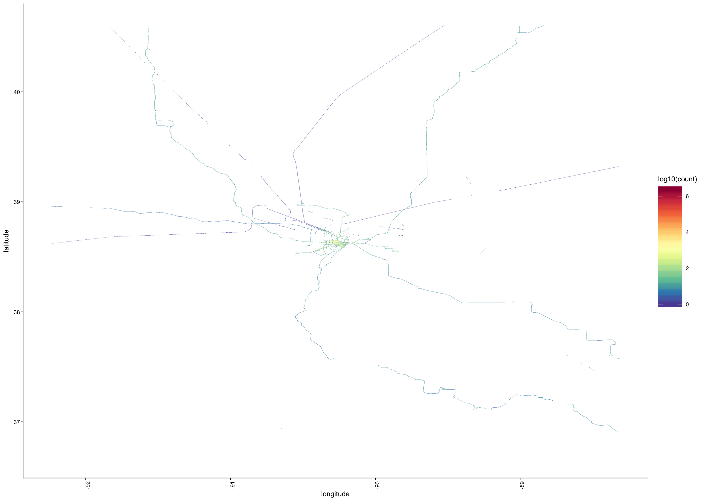
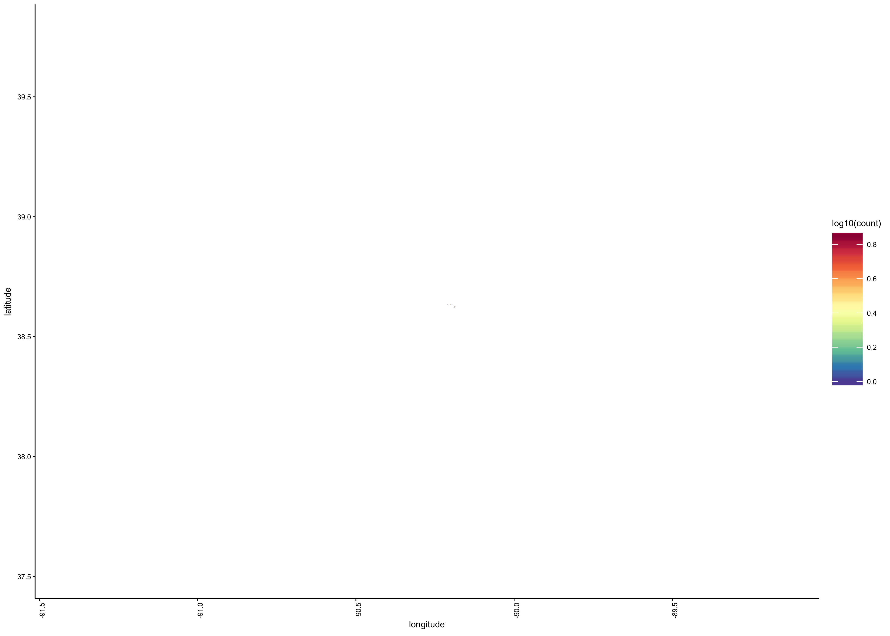

<!-- --><!-- --><!-- --><!-- --><!-- --><!-- --><!-- --><!-- --><!-- --><!-- --><!-- --><!-- --><!-- --><!-- --><!-- --><!-- -->

### Pressure
- lat max = 39.773
- lat min = 37.5205
- lon max = -89.149
- lon min = -91.4015

<!-- --><!-- --><!-- -->

Var1             Freq
-----------  --------
Automotive      57709
Bike            26659
Running           918
Stationary    3462021
Unknown        386564
Walking         97786

