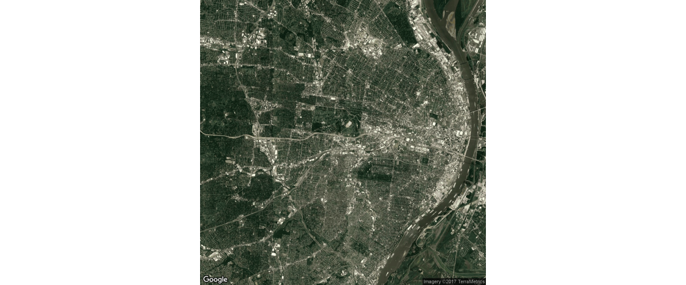

# CatMap
JL  
10/26/2017  


```r
library(jsonlite)


system.time(x <- fromJSON("~/Go/src/github.com/rotblauer/tileTester2/out.json"))
loc=data.frame()
loc = do.call(rbind.data.frame, x$features$geometry$coordinates)
loc$elevation =x$features$properties$Elevation
loc$accuracy =x$features$properties$Accuracy

colnames(loc) =c("lon","lat","elevation")

save(loc,file = "loc.RData")
```


```r
load("loc.RData")
library(ggmap)
```

```
## Loading required package: ggplot2
```

```r
mapImageData1 <- get_map(location = c(lon =-90.2794 , lat = 38.6270),
    color = "color",
    source = "google",
    maptype = "satellite",
    zoom = 12)
```

```
## Map from URL : http://maps.googleapis.com/maps/api/staticmap?center=38.627,-90.2794&zoom=12&size=640x640&scale=2&maptype=satellite&language=en-EN&sensor=false
```

```r
ggmap(mapImageData1,
    extent = "device",
    ylab = "Latitude",
    xlab = "Longitude")
```

```
## Warning: `panel.margin` is deprecated. Please use `panel.spacing` property
## instead
```

<!-- -->

```r
 mapPoints <- ggmap(mapImageData1) +geom_point(aes(x = lon, y = lat), data = loc, alpha = .03)
 mapPoints
```

```
## Warning: Removed 581406 rows containing missing values (geom_point).
```

<!-- -->
